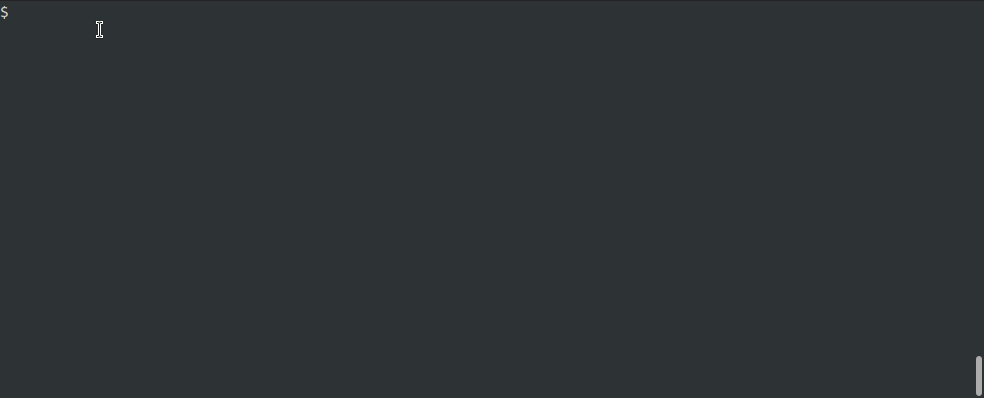

# Nyancat 

I.e, cat but with syntax highlighting

## Setup
Clone the repo to wherever you clone your other gihub repos. I clone mine into `~/Github`
``` sh
cd ~/Github
clone https://github.com/alexjgriffith/nyancat
```

Now lets set the two bash files to be executable. You can vet them before this.
``` sh
cd nyancat
chmod +x nyancat
# chmod +x nyancatlo # optional, right now only works for emacs
```

Finally you can put a symbolic link to it somewhere on your `$PATH`. For local binaries I have `~/bin` on my `$PATH` for local scripts like this.

```sh
ln -s ${PWD}/nyancat $HOME/bin
# ln -s ${PWD}/nyancatlo $HOME/bin
```

Now you'll be able to print your source files with syntax highlighting from the shell! Test it out on `sample.c` in the resources folder of this repo :)
```sh
nyancat resources/sample.c
```

## Examples

``` sh
nyancat sample.c
```



``` sh
nyancat -l sample.c
```

``` sh
nyancat -s=nord sample.c
```

``` sh
nyancat -x -s=nord
```

``` sh
nyancat -d -x -s=nord
```
