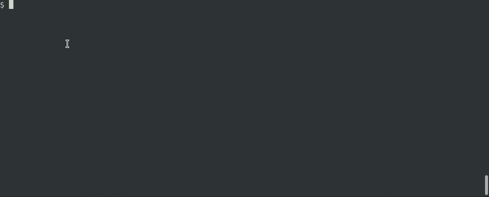
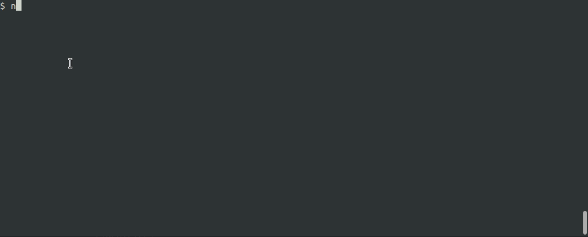
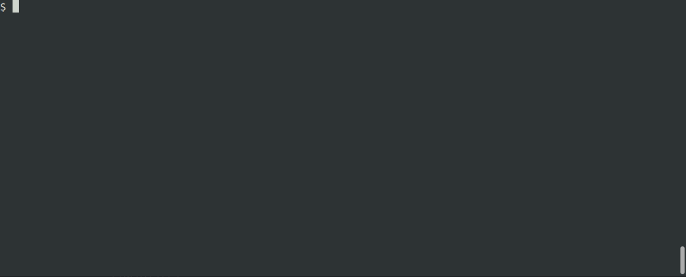

# Nyancat 

I.e, cat but with syntax highlighting. 


This project is a wrapper around [Pygments](https://pygments.org/) that presents a minimal subset of pygmentize's capabilities, specifically syntax highlighting files.

## Setup
Clone the repo to wherever you clone your other gihub repos. I clone mine into `~/Github`
``` sh
cd ~/Github
clone https://github.com/alexjgriffith/nyancat
```

Now lets set the two bash files to be executable. You can vet them before this.
``` sh
cd nyancat
chmod +x nyancat
# chmod +x nyancatlo # optional, right now only works for emacs
```

Finally you can put a symbolic link to it somewhere on your `$PATH`. For local binaries I have `~/bin` on my `$PATH` for local scripts like this.

```sh
ln -s ${PWD}/nyancat $HOME/bin
# ln -s ${PWD}/nyancatlo $HOME/bin
```

Now you'll be able to print your source files with syntax highlighting from the shell! Test it out on `sample.c` in the resources folder of this repo :)
```sh
nyancat resources/sample.c
```

## Examples

### Normal Usage
To print the whole file with your systems default colours just use `nyancat [file]`

``` sh
nyancat sample.c
```


### Printing with Line Numbers
Sometimes you want line numbers, you can pass in the arg `-l` and you'll get them!

``` sh
nyancat -l sample.c
```


### Setting the Style
If you don't want to use your terminal's default colours you can pass in a style with the `-s=` flag. To see the full list of styles available use `nyancat -a`.
``` sh
nyancat -s=nord sample.c
```


### Check Out the Style


``` sh
nyancat -x -s=nord
```



### See How the pygmentize Calls are Generated
As I say above, Nyancat is just a wrapper around Pygments and its utility pygemntize. To see what is actually being called on your system pass in the `-d` flag.

``` sh
nyancat -d -x -s=nord
```


